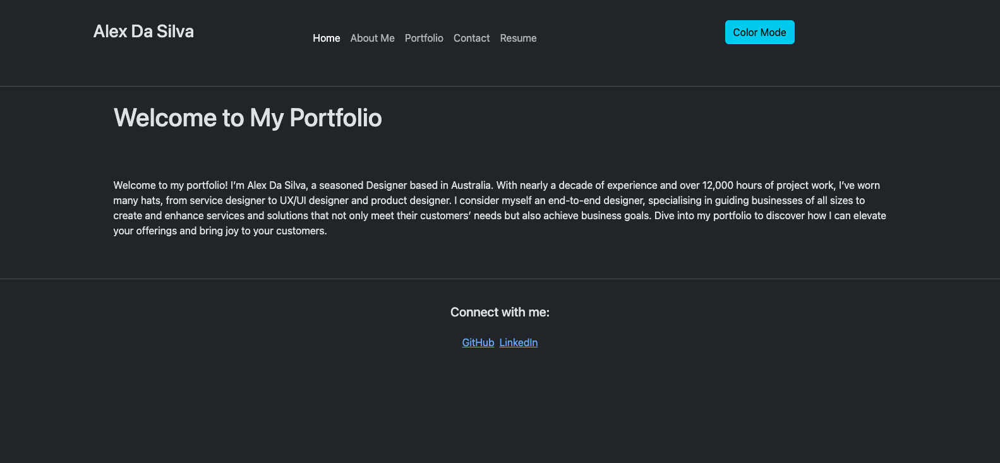
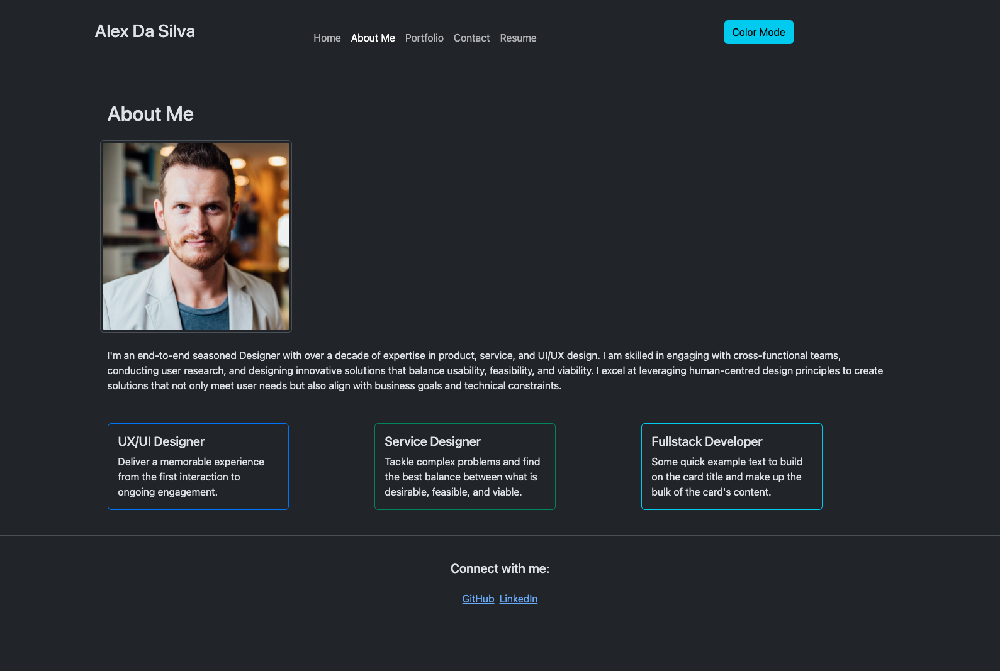
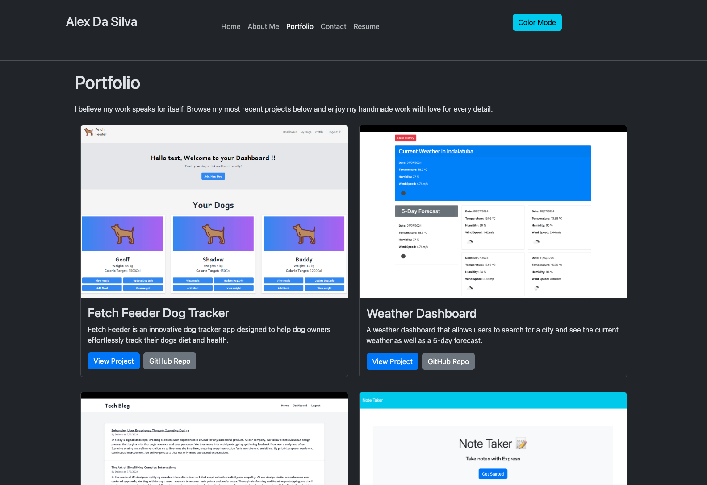
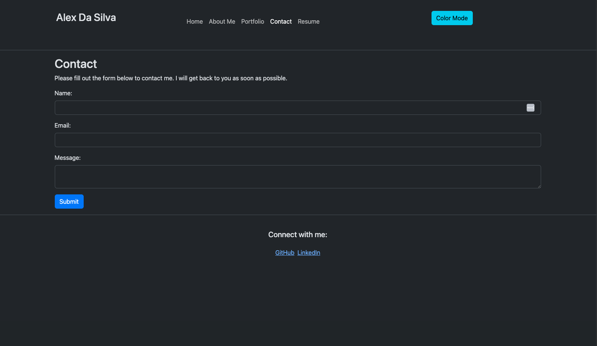
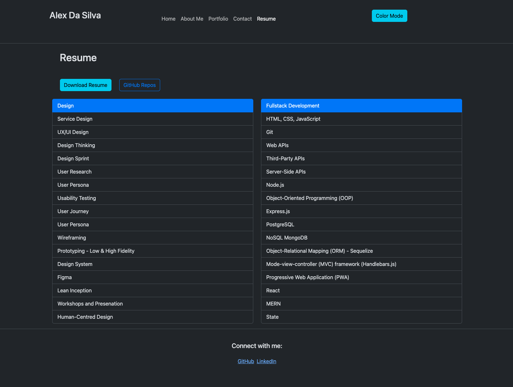
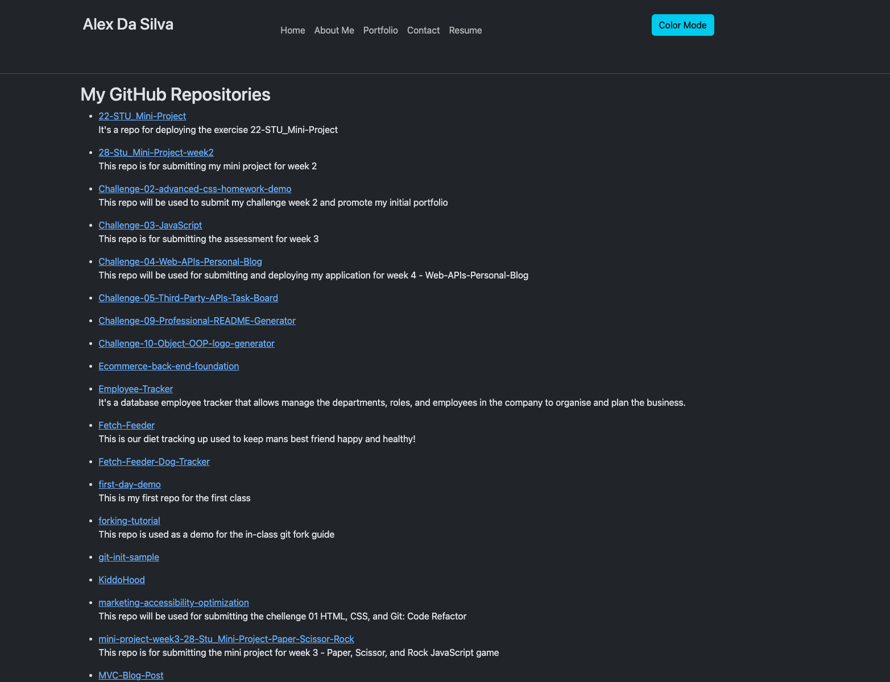
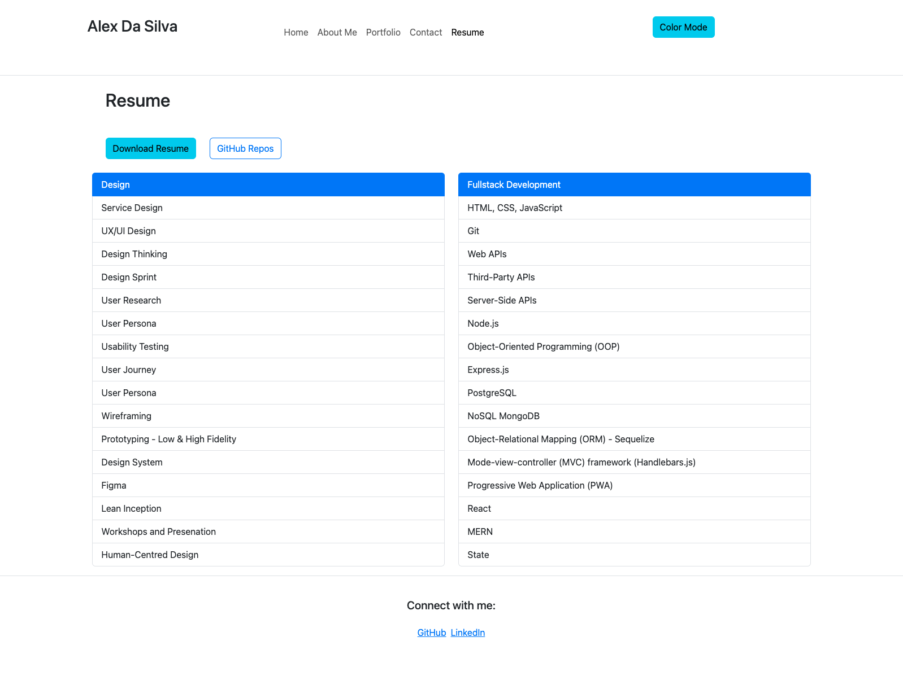

# React + Vite Portfolio Mastery

A portfolio application built with React, Vite, and custom Bootstrap styling, showcasing projects and professional information. The app is deployed on Netlify.

## Table of Contents

- [Features](#features)
- [Technologies Used](#technologies-used)
- [Installation](#installation)
- [Usage](#usage)
- [Environment Variables](#environment-variables)
- [Deployment](#deployment)
- [Screenshoots](#screenshoots)
- [License](#license)
- [Contributing](#contributing)

## Features

- Portfolio showcasing various projects
- Custom light and dark mode themes based on Bootstrap
- API integration with GitHub to display repositories
- Responsive design
- React Router for navigation

## Technologies Used

- React
- Vite
- Bootstrap
- React Router
- Netlify (for deployment)

## Installation

1. **Clone the repository:**

   ```bash
   git clone git@github.com:Alex-Design-For-Reap/ReactPortfolioMastery.git
   cd ReactPortfolioMastery

   ```

2. **Install dependencies:**

   ```bash
   npm install
   ```

3. **Set up MongoDB:**

   Ensure you have MongoDB installed and running locally.

4. **Create a .env file in the root directory and add your environment variables**

5. **Start the development server**

   ```bash
   npm run dev
   ```

## Usage

1. **To run the application locally, use the following command**

   ```bash
   npm run dev
   ```

2. **Run the application**
   ```bash
   npm start
   ```
   Navigate to http://localhost:3000 to view the app.

## Environment Variables

1. **Create a .env file in the root directory of your project with the following content**
   ```bash
   VITE_GITHUB_API_KEY=your_github_api_key_here
   ```

## Deployment

The application is deployed on Netlify. Access it here: 👉 👉 👉 👉 👉 https://main--leafy-speculoos-c6fc46.netlify.app/

Follow these steps to deploy your own instance:

Push your code to GitHub.
Create a new site on Netlify and link your GitHub repository.
Set the build command to npm run build and the publish directory to dist.
Add your environment variables in the Netlify dashboard under Site Settings > Build & Deploy > Environment > Environment Variables.

## Screenshoots

### Home



### About Me



### Portfolio



### Contact



### Resume



### GitHub API to fetch repositories information from GitHub Account



### Light Mode



## License

This project is licensed under the MIT License. See the LICENSE file for details.

### Additional Notes:

1. **Environment Variables**: Ensure you have the `VITE_` prefix for environment variables when using Vite.
2. **Links and URLs**: Replace placeholder URLs and usernames with actual values specific to your project.
3. **Custom Bootstrap Styling**: Ensure your CSS for light and dark mode is correctly integrated, as per your earlier steps.
4. **API Integration**: If you add more APIs or functionalities, update the README to reflect those changes.

## Contributing

If you would like to contribute to this project, please follow these steps:

1. Fork the repository.
2. Create a new branch:
   ```sh
   git checkout -b feature/YourFeature
   ```
3. Make your changes.
4. Commit your changes:
   ```sh
   git commit -m 'Add YourFeature'
   ```
5. Push to the branch:
   ```sh
   git push origin feature/YourFeature
   ```
6. Open a pull request.

## Other ways to contribute and questions

Contributions are welcome!
If you want to contribute or have any questions, here are my channels:
gitHub: https://github.com/Alex-Design-For-Reap

email: s.alexsilva@gmail.com

Author: Alex Da Silva https://github.com/Alex-Design-For-Reap/ReactPortfolioMastery
